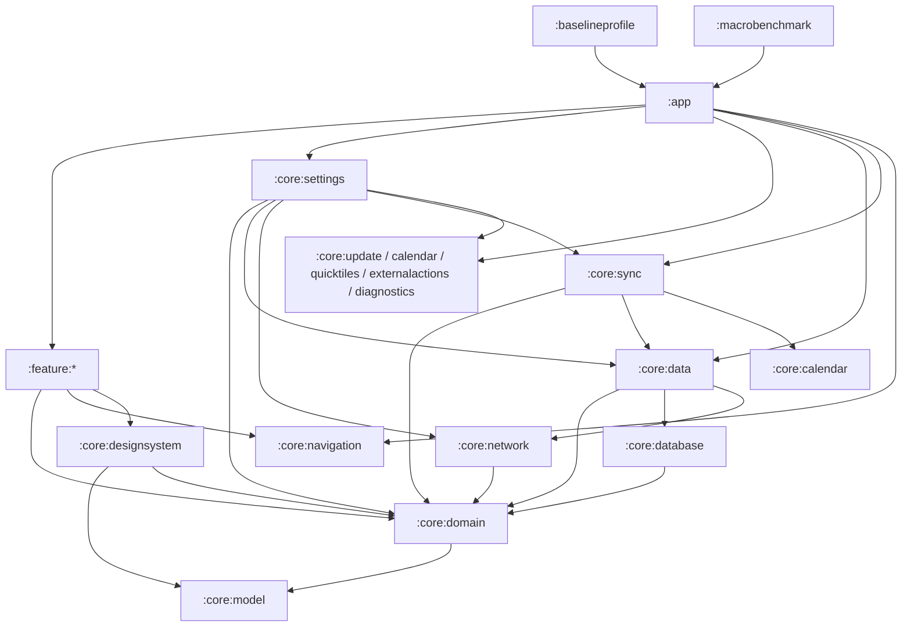

# 1memos 架构护栏（Navigation 3 + Settings 最终边界）

本文档描述 **当前已落地** 的模块边界、依赖方向、DI 所有权与不可变约束。
权威设计输入见 `docs/superpowers/specs/2026-07-14-settings-navigation3-redesign-design.md`。
本地/CI 门禁：`scripts/verify-architecture.sh` 与 `FinalModuleBoundariesTest`。

---

## 当前工程概览

- 组合根：`:app`（唯一 Composition Root）
- 入口：`OneMemosApplication`、`MainActivity`
- UI：Jetpack Compose + **Navigation 3**（`NavKey` / `NavDisplay` / 六栈状态机）
- DI：Hilt；默认绑定只在 `:app` 的 `di/` 最终装配
- 后台：WorkManager（`Configuration.Provider` + `HiltWorkerFactory`）
- 性能：`:baselineprofile`、`:macrobenchmark`（`targetProjectPath = ":app"`）

### Gradle 模块

**App / 测量**

- `:app`
- `:baselineprofile`
- `:macrobenchmark`

**Core**

- `:core:model`、`:core:domain`（纯 Kotlin）
- `:core:database`、`:core:network`、`:core:data`、`:core:sync`
- `:core:designsystem`、`:core:navigation`、`:core:performance`
- `:core:settings`（Settings 能力编排）
- `:core:update`、`:core:calendar`、`:core:quicktiles`、`:core:externalactions`、`:core:diagnostics`

**Feature**

- `:feature:home`、`:feature:collections`、`:feature:todo`、`:feature:profile`
- `:feature:editor`、`:feature:sharecard`、`:feature:auth`、`:feature:welcome`
- `:feature:settings`、`:feature:quickcapture`、`:feature:start`

无 `:feature:archived`：归档键由 `HomeEntryContributor` 拥有。

---

## 依赖方向



硬性规则：

1. Feature **不得**互相依赖。
2. Core **不得**依赖 `:app` 或任何 `:feature:*`。
3. `:feature:settings` 项目依赖白名单仅为 `:core:domain`、`:core:navigation`、`:core:designsystem`。
4. 跨 Feature 导航只提交 `:core:navigation` 的类型化 `NavKey`。
5. ViewModel 不接收、不缓存 `OneMemosNavigator`；Navigator 只到 Compose entry 层。
6. Feature 不得声明 `@Module` / `@Provides` / `@Binds` / `@InstallIn`。

---

## Navigation 3

### 六个独立顶层返回栈

分区（`TopLevelSection`）各有独立栈，配置变更与进程恢复后按可序列化 `NavKey` 恢复：

| 分区 | 根键（示意） | Entry 所有者 |
| --- | --- | --- |
| 随笔 | `HomeKey`（含 `ArchivedKey`） | `HomeEntryContributor` |
| 合集 | `CollectionsKey` | `CollectionsEntryContributor` |
| 待办 | `TodoKey` / `TodoItemKey` | `TodoEntryContributor` |
| 我的 | `ProfileKey` | `ProfileEntryContributor` |
| 设置 | `SettingsHubKey` + 九个 Settings 键 | `SettingsEntryContributor` |
| 编辑/分享等覆盖栈 | `EditorKey`、`ShareCardKey`、`AuthKey`、`WelcomeKey` 等 | 对应 Feature contributor |

`:app` 通过 `appEntryContributors` 显式聚合 contributor，Host（`AppNavigationHost`）只解析 owner 并渲染 entry，**不**直接构造 Feature `*Screen`。

### 外部输入

分享、Todo 通知、深链等经 `ExternalNavigationMapper` 映射为受控键后进入状态机；未知值拒绝，不注入字符串 Route。

---

## Settings

### 七个能力接口（`:core:domain`）

| 表面 | 接口 | 实现（`:core:settings`） |
| --- | --- | --- |
| 设置首页 | `SettingsHubCapability` | `SettingsHubCapabilityImpl` |
| 账号与同步 | `AccountSyncSettingsCapability` | `AccountSyncSettingsCapabilityImpl` |
| 记录与编辑 | `RecordEditingSettingsCapability` | `RecordEditingSettingsCapabilityImpl` |
| 提醒与日历 | `ReminderCalendarSettingsCapability` | `ReminderCalendarSettingsCapabilityImpl` |
| 存储与离线 | `StorageOfflineSettingsCapability` | `StorageOfflineSettingsCapabilityImpl` |
| 外观与交互 | `AppearanceInteractionSettingsCapability` | `AppearanceInteractionSettingsCapabilityImpl` |
| 关于与高级 | `AboutAdvancedSettingsCapability` | `AboutAdvancedSettingsCapabilityImpl` |

默认 Hilt 绑定 **仅** 在 `app/.../di/SettingsCapabilityModule.kt`，每种接口恰好一次。

### 平台窄端口

Feature Settings 通过 `SettingsPlatformActionDispatcher` / `SettingsUpdateDeliveryDispatcher`（CompositionLocal）请求：

- 日历权限、悬浮窗权限、分享 URI、打开 Quick Capture / 截图入口
- 更新未知来源设置与安装器交付

实现位于 `:app`（`AppSettingsPlatformActionDispatcher`、`AppSettingsUpdateDeliveryDispatcher`）。
平台模块需要包身份或应用内目标时，只消费 app 注入的窄端口（如 `AppIdentityPort`、`QuickCaptureTargetPort`），禁止 `core → app` 编译依赖。

---

## DI 所有权（默认提供源）

| 能力 | 提供模块 | 备注 |
| --- | --- | --- |
| Settings 七能力绑定 | `:app`（SettingsCapabilityModule） | 实现类在 `:core:settings` |
| OkHttp / Retrofit / MemosApi | `:app`（NetworkModule 等） | 单默认源 |
| Room / Repository 装配 | `:app`（AppModule） | DB 实现在 `:core:database` / `:core:data` |
| SyncScheduler / Workers 绑定 | `:app`（WorkerModule） | Worker 实现在 `:core:sync` |
| 更新 / 日历 / Tile / 诊断绑定 | `:app` 对应 Module | 实现在各平台 Core |
| WorkManager / ImageLoader Application 入口 | `:app`（OneMemosApplication） | 不可下沉 |
| Navigation 契约与状态机 | `:core:navigation` | Host 在 `:app` |

迁移规则：同一默认类型只允许一个提供源；替换时“新源生效后删除旧源”。

---

## 不可变回归约束（§10.1）

字面量与行为必须保持一致（由 `ImmutableRegressionContractsTest` 与 `verify-architecture` 锁定）：

1. `applicationId`：`cc.pscly.onememos`
2. WorkManager：`one_memos_sync`；输入键 `force_full_sync` / `is_periodic` / `followup_sync`
3. 周期同步：`one_memos_periodic_sync`
4. 派生字段重建：`one_memos_rebuild_memo_derived_fields`
5. 附件预取：`one_memos_attachment_prefetch`
6. Room：`version = 11`；库文件 `one_memos.db`
7. FileProvider：`${applicationId}.fileprovider`；路径 `share_cards/`、`screenshots/`、`shared/`
8. 外部编辑 extra：`cc.pscly.onememos.extra.START_EDITOR_UUID`
9. `baselineprofile` / `macrobenchmark`：`targetProjectPath = ":app"`
10. `OneMemosApplication`：`Configuration.Provider`、`HiltWorkerFactory`、`ImageLoaderFactory`

旧字符串 Routes 已删除，不再作为导航源。

---

## 门禁与发布

### 本地

```bash
./scripts/verify-architecture.sh
./scripts/verify.sh
```

PowerShell：

```powershell
.\scripts\verify-architecture.ps1
.\scripts\verify.ps1
```

聚焦架构测试：

```bash
./gradlew :app:testDebugUnitTest --tests cc.pscly.onememos.architecture.FinalModuleBoundariesTest --stacktrace
```

### CI

`.github/workflows/android-benchmark.yml`：

- 触发：`main` push、`v*` Tag、PR、无参数 `workflow_dispatch`
- 执行 `./scripts/verify.sh`，上传时间戳 Benchmark APK Artifact
- **不**创建 Tag，**不**创建/更新 GitHub Release
- `main` 与 `v*` 缺少固定发布签名 Secrets 时失败
- 固定证书 SHA-256：`58749c794f0c54af6b69bb6d80248a9fda0b75c687fde55b98d9575fc091633e`

### 稳定发布顺序

1. 完整门禁通过  
2. 推送 `main`  
3. 推送 `vMAJOR.MINOR.PATCH` Tag  
4. 等待 Tag Actions 成功并复核 Artifact  
5. 人工创建非草稿、非预发布 latest Release（仅上传复核通过的 Benchmark APK）
