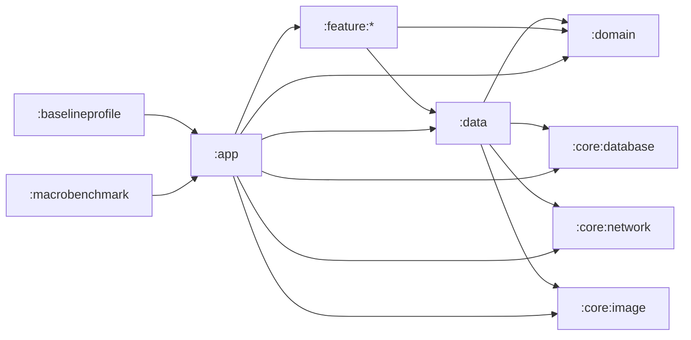

# 1memos 架构护栏（Hybrid 多模块重构前锁定）

本文档用于在即将进行的“Hybrid Gradle 多模块重构”前，把 **模块边界、依赖方向、DI 所有权** 与 **不可变约束** 固化下来。

目标：不新增用户可见功能、不改变行为语义；重构只允许改变“代码组织方式/模块拆分方式”，并为后续 **设计系统收敛** 与 **性能可测/防回归** 铺路。

---

## 当前工程概览（截至 2026-02-02）

- Gradle 模块：`:app`、`:baselineprofile`、`:macrobenchmark`
- 组合根（Composition Root）：`:app`
- 入口点：
  - Application：`app/src/main/java/cc/pscly/onememos/OneMemosApplication.kt`
  - Launcher Activity：`app/src/main/java/cc/pscly/onememos/MainActivity.kt`
- UI：Jetpack Compose + Navigation（路由在 `app/src/main/java/cc/pscly/onememos/ui/Routes.kt`）
- DI：Hilt（`@HiltAndroidApp` / `@AndroidEntryPoint` / `@HiltWorker`）
- 后台：WorkManager（通过 `Configuration.Provider` + `HiltWorkerFactory`）

---

## 背景与目标

本轮（Hybrid 多模块化）需要先把“契约”写清楚再动代码：

- 目的 1：把 `:app` 的“组合根”职责固定下来，避免 feature 之间形成隐式耦合。
- 目的 2：把关键常量与协议（WorkManager/DB/FileProvider/Navigation/benchmark）固化为不可变约束，保证重构中不发生行为漂移。
- 目的 3：为后续“设计系统收敛”（统一 UI 组件与交互）与“性能可测/防回归”（baseline profile + macrobenchmark）提供稳定的模块基础。

工程约定：仓库 Windows-first；命令示例优先使用 PowerShell + `\.\gradlew.bat`。

---

## 模块边界（Module Boundaries）

### 现在（单模块内的“逻辑分层”，按 package）

`:app` 内部按 package 大致分层：

- `cc.pscly.onememos.ui.*`：界面与导航（Compose Screen、ViewModel、路由）
- `cc.pscly.onememos.worker.*`：WorkManager Worker 与调度器
- `cc.pscly.onememos.di.*`：Hilt Modules（提供网络/数据库/仓库/调度器/ImageLoader 等）
- `cc.pscly.onememos.core.*`：基础设施（database/network/performance 等）
- `cc.pscly.onememos.data.*`：数据层实现（RepositoryImpl、settings/cache/auth 等）
- `cc.pscly.onememos.domain.*`：领域层（接口、模型、用例/工具）

### 目标（Hybrid 多模块后的“Gradle 模块边界”）

重构后推荐按“可复用程度 + Android 依赖程度”拆分（示例命名；允许细节调整，但必须遵守依赖方向）：

- `:app`：唯一 Composition Root；承载 Application/Manifest/Navigation Host/顶层 DI 装配/WorkManager 配置
- `:core:database`：Room DB（`OneMemosDatabase`、dao、entity、migration）
- `:core:network`：OkHttp/Retrofit、API interface、拦截器、URL 组装
- `:core:image`：图片加载策略（Coil 配置入口、缓存策略），但 Application 仍可作为最终 ImageLoaderFactory
- `:domain`：纯 Kotlin（接口/模型/业务规则）；禁止依赖 AndroidX
- `:data`：Repository 实现；依赖 `:domain` + `:core:*`
- `:feature:*`：各功能 UI/Presentation（例如 editor/home/profile/settings/auth/sharecard/quickcapture 等）

硬性规则：

- Feature 模块 **不得互相依赖**（feature -> feature 禁止）。跨 feature 交互通过：
  - `:domain` 的接口/事件/模型；或
  - `:app` 作为导航与编排层；或
  - 明确的公共 `:core:*`（仅基础设施/通用组件）。
- `:app` 不能“下沉业务逻辑”。业务逻辑应归属 `:domain`/`:data`/`:core:*`。
- `:domain` 必须保持可单测、可 JVM 运行（无 Android 依赖）。

---

## 依赖方向（Dependency Directions）

允许的依赖方向（箭头方向表示“依赖于”）：

备注：

- `:baselineprofile` 与 `:macrobenchmark` 的职责是“测量/生成 profile”，它们的目标 app 必须保持为 `:app`（见不可变约束）。

---

## 模块所有权表（DI Ownership Map）

“所有权”= 哪个 Gradle 模块负责 **提供**（provide/bind）该能力的默认实现；其他模块仅 **消费**。

### 当前（事实：DI 提供者集中在 `:app`）

当前所有 Hilt 的 `@Module/@InstallIn` 都集中在 `:app`：

- 目录：`app/src/main/java/cc/pscly/onememos/di/*`
- 模块：`NetworkModule`、`FlowBackendModule`、`WorkerModule`、`ImageLoaderModule`、`AppModule`

说明：对外可将其理解为“4 个基础设施模块（Network/FlowBackend/Worker/ImageLoader）+ 1 个 app 聚合模块（AppModule，用于 DB/Repository/Storage 的过渡装配）”。

这是一种“过渡期策略”：feature 虽已拆分为独立 Gradle 模块，但基础设施的默认实现仍由 `:app` 统一提供，避免迁移期出现循环依赖与重复绑定。

提供方清单（事实）：

- OkHttpClient / Retrofit / MemosApi：`app/src/main/java/cc/pscly/onememos/di/NetworkModule.kt`
- FlowBackendApi（含设备 headers/info 提供）：`app/src/main/java/cc/pscly/onememos/di/FlowBackendModule.kt`
- SyncScheduler（WorkManagerSyncScheduler -> SyncScheduler）：`app/src/main/java/cc/pscly/onememos/di/WorkerModule.kt`
- ImageLoader（Coil，基于 `context.imageLoader`）：`app/src/main/java/cc/pscly/onememos/di/ImageLoaderModule.kt`
- Room DB（OneMemosDatabase + MemoDao）与 Repository/Storage 绑定：`app/src/main/java/cc/pscly/onememos/di/AppModule.kt`

不可下沉的 Application 约束（必须保持）：

- `OneMemosApplication` 仍持有 WorkManager 初始化链路：实现 `Configuration.Provider`，并注入/持有 `HiltWorkerFactory`。
- `OneMemosApplication` 仍实现 `ImageLoaderFactory`；任何通过 Hilt 暴露的 `ImageLoader` 必须与 Application 的配置保持一致。

消费侧约束（必须保持）：

- `:feature:*` 不直接 `new` OkHttp/Retrofit/Room/WorkManager/ImageLoader 等基础设施对象；只能通过依赖注入消费抽象（优先以 `:core:domain` 中的接口为边界）。

### 目标（多模块 DI Ownership Map，仍由 `:app` 统一装配）

目标形态是“提供者下沉、装配集中”：默认实现的提供方随模块职责下沉到 `:core:*`，但 `:app` 仍是唯一 Composition Root（负责把实现连接到接口并承载 Android 入口点）。

| 能力/类型 | 目标所有权（Provide 模块） | 当前（过渡期） | 备注 |
| --- | --- | --- | --- |
| OkHttpClient / Interceptors | `:core:network` | `:app`（NetworkModule） | 全局默认单例只能有一个来源；需要多 client 用 `@Qualifier` 区分 |
| Retrofit / MemosApi / FlowBackendApi | `:core:network` | `:app`（NetworkModule/FlowBackendModule） | Retrofit baseUrl 仅占位，MemosApi 实际用 `@Url`；FlowBackendApi 依赖 BuildConfig baseUrl |
| Room DB / Dao | `:core:database` | `:app`（AppModule） | DB 版本/文件名/迁移不可变（见“不变约束”章节） |
| TokenStorage / SettingsRepository 等本地存储 | `:core:data` | `:app`（AppModule） | 需要 Android 依赖（如加密存储），仍建议归属 data 层并对外暴露抽象 |
| Repository 接口（MemoRepository/CacheRepository/SettingsRepository 等） | `:core:domain` | `:app`（AppModule 直接装配） | 仅声明接口与模型；feature 仅依赖接口 |
| Repository 实现（*Impl） | `:core:data` | `:app`（AppModule 直接装配） | `:app` 负责把实现绑定到接口（或迁移期临时由 `:app` 持有绑定） |
| SyncScheduler 接口 | `:core:domain` | `:app`（WorkerModule） | feature 通过接口触发同步/调度，不感知 WorkManager |
| WorkManagerSyncScheduler / Workers / WorkRequests | `:core:sync` | `:app`（WorkerModule + `cc.pscly.onememos.worker.*`） | 依赖 WorkManager；但 WorkManager 初始化仍由 `:app` 负责 |
| WorkManager Configuration.Provider / HiltWorkerFactory 装配 | `:app` | `:app`（OneMemosApplication） | 必须由 Application 持有 |
| ImageLoader（Coil） | `:app` | `:app`（OneMemosApplication + ImageLoaderModule） | 由于 `ImageLoaderFactory` 仍在 Application，保持 `:app` 作为唯一默认提供源 |
| Navigation contracts（路由/目的地契约） | `:core:navigation` | `:app`（现为 app 内 Routes） | `:app` 负责 NavHost 编排；feature 提供目的地实现但不直接相互依赖 |

### 重复绑定风险（迁移时必须显式规避）

多模块迁移时最常见的踩坑是“同一类型出现两份默认绑定”，导致编译失败或运行期行为不一致。需要重点关注：`OkHttpClient`、`Retrofit`、`ImageLoader`、`OneMemosDatabase/Dao`、各类 Repository、SyncScheduler。

规避方式：

- 每种“默认单例”必须只有一个提供源（一个 Gradle 模块 + 一套 Hilt binding），迁移时不要让 `:app` 与 `:core:*` 并存两份。
- 需要多实现/多实例时使用 `@Qualifier`/`@Named` 区分；不要复制默认 binding。
- 迁移顺序建议：先把实现 + provider 移到目标模块，再从 `:app` 删除旧 provider（避免重复安装到同一 Component）。
- 测试替换使用 `@TestInstallIn` 或 fake module；不要在 main 源集里添加第二份默认提供方。

---

## 不可变约束（必须保持不变）

以下约束 **必须以字面量一致** 的方式保留。任何变更都视为行为变更，会导致：已排队/已持久化任务失效、数据库不兼容、分享 URI 失效、导航深链路/参数解析异常、benchmark/profile 流水线失效。

### 1) WorkManager：Unique Work Name / Input Keys

- `app/src/main/java/cc/pscly/onememos/worker/MemosSyncWorker.kt`
  - `MemosSyncWorker.UNIQUE_WORK_NAME = "one_memos_sync"`
  - `MemosSyncWorker.KEY_FORCE_FULL_SYNC = "force_full_sync"`
  - `MemosSyncWorker.KEY_IS_PERIODIC = "is_periodic"`
  - `MemosSyncWorker.KEY_FOLLOWUP_SYNC = "followup_sync"`
- `app/src/main/java/cc/pscly/onememos/worker/WorkManagerSyncScheduler.kt`
  - 周期同步 unique name：`"one_memos_periodic_sync"`
  - 周期同步 tag：`"one_memos_periodic_sync"`
- `app/src/main/java/cc/pscly/onememos/worker/MemoDerivedFieldsRebuildWorker.kt`
  - `MemoDerivedFieldsRebuildWorker.UNIQUE_WORK_NAME = "one_memos_rebuild_memo_derived_fields"`
- `app/src/main/java/cc/pscly/onememos/worker/AttachmentPrefetchWorker.kt`
  - `AttachmentPrefetchWorker.UNIQUE_WORK_NAME = "one_memos_attachment_prefetch"`

补充约束（同属 WorkManager 初始化链路，不建议变更）：

- `app/src/main/AndroidManifest.xml`：移除 `androidx.work.WorkManagerInitializer`（使用 `Configuration.Provider` + Hilt WorkerFactory）

### 2) Room / DB

- `app/src/main/java/cc/pscly/onememos/core/database/OneMemosDatabase.kt`
  - `@Database(..., version = 9, ...)`
- `app/src/main/java/cc/pscly/onememos/di/AppModule.kt`
  - DB 文件名（Room builder 第三个参数）：`"one_memos.db"`

### 3) FileProvider

- `app/src/main/AndroidManifest.xml`
  - authorities：`${applicationId}.fileprovider`
- `app/src/main/res/xml/file_paths.xml`
  - 暴露子路径（必须保持一致）：
    - `cache-path`：`share_cards/`
    - `cache-path`：`screenshots/`
    - `files-path`：`shared/`

### 4) Navigation Contracts（Routes + 参数约定）

- `app/src/main/java/cc/pscly/onememos/ui/Routes.kt`
  - 路由常量：
    - `WELCOME = "welcome"`
    - `HOME = "home"`
    - `PROFILE = "profile"`
    - `ARCHIVED = "archived"`
    - `SETTINGS = "settings"`
    - `AUTH = "auth"`
    - `EDITOR = "editor"`
    - `SHARE_CARD = "share_card"`
  - 参数 key：
    - `ARG_UUID = "uuid"`
    - `ARG_AUTH_MODE = "mode"`
  - 编码规则：构造路由时必须对参数执行 `Uri.encode(...)`（uuid 可能包含 `/`，否则可能出现白屏/路由匹配失败）。

参数读取侧的解码规则（必须与 encode 成对）：

- `app/src/main/java/cc/pscly/onememos/ui/feature/editor/EditorViewModel.kt`：对 `uuid` 执行 `Uri.decode(...)`
- `app/src/main/java/cc/pscly/onememos/ui/feature/sharecard/ShareCardViewModel.kt`：对 `uuid` 执行 `Uri.decode(...)`

补充说明：`Routes.auth(mode)` 也会对 `mode` 执行 `Uri.encode(...)`。目前 `AuthViewModel` 读取 `Routes.ARG_AUTH_MODE` 时使用的值是简单字符串（如 `custom`），未显式 decode；如果未来 mode 允许包含特殊字符，读取侧必须补齐 decode，同时要兼容历史值。

### 5) External Intent Extras

- `app/src/main/java/cc/pscly/onememos/MainActivity.kt`
  - `MainActivity.EXTRA_START_EDITOR_UUID = "cc.pscly.onememos.extra.START_EDITOR_UUID"`

### 6) Baseline Profile / Macrobenchmark

- `baselineprofile/build.gradle.kts`
  - `targetProjectPath = ":app"`
- `macrobenchmark/build.gradle.kts`
  - `targetProjectPath = ":app"`

---

## Feature 模块“必须遵守”的规则清单

- Feature 不得直接依赖其它 Feature。
- Feature 不得直接访问 Room/Retrofit/OkHttp/WorkManager 的具体实现；只能通过 `:domain` 接口与 `:data`/`:core:*` 暴露的抽象消费。
- `:app` 不得被移除或重命名；`applicationId` 仍为 `cc.pscly.onememos`（见 `app/build.gradle.kts`）。
- 所有“不可变约束”字面量必须保持一致；如确需调整，必须先提供兼容迁移策略（例如 WorkManager 迁移/双写/兼容读取），并通过回归验证。

---

## 工程约束与验证

每个重构波次（无论是否只移动代码）都必须满足：

- 单元测试 + Lint + Debug 构建（开发可用性）：
  - `\.\gradlew.bat testDebugUnitTest --stacktrace`
  - `\.\gradlew.bat lintDebug --stacktrace`
  - `\.\gradlew.bat :app:assembleDebug --stacktrace`
- Benchmark 构建（性能测量可用性，避免 debug 变体掩盖性能问题）：
  - `\.\gradlew.bat :app:assembleBenchmark --stacktrace`
- Profile/Benchmark 模块可构建（不要求接设备跑测，但要求 assemble 通过）：
  - `\.\gradlew.bat :baselineprofile:assembleBenchmark --stacktrace`
  - `\.\gradlew.bat :macrobenchmark:assembleBenchmark --stacktrace`

若需要生成 baseline profile（需要设备/模拟器），在确认环境后再执行对应 instrumentation 任务。
